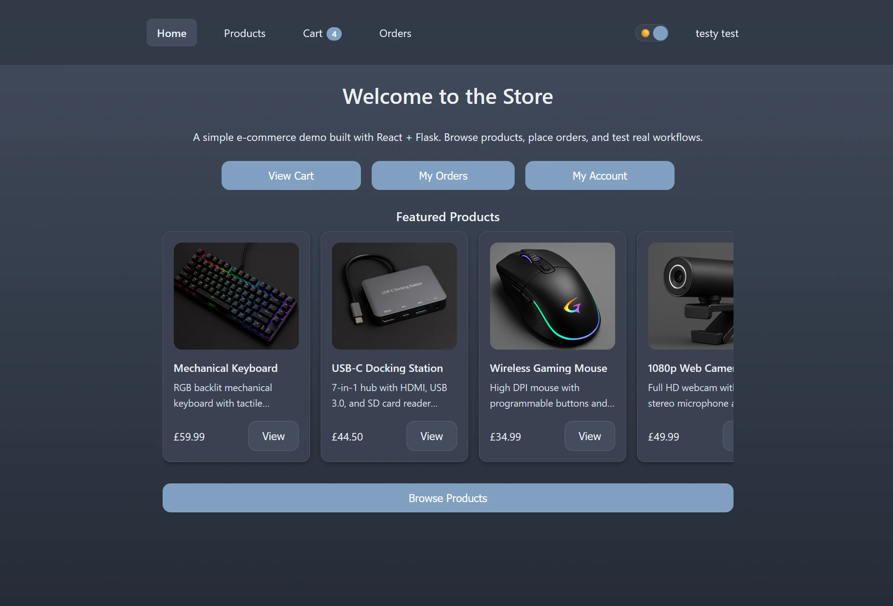
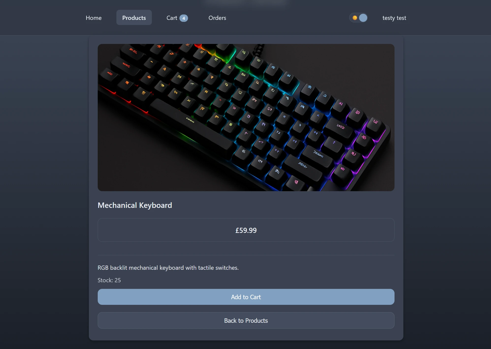
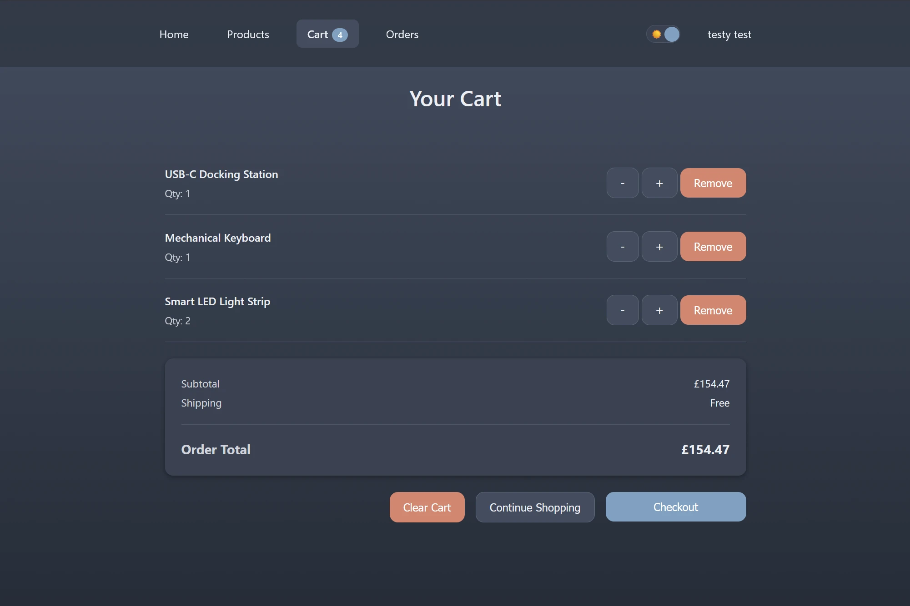
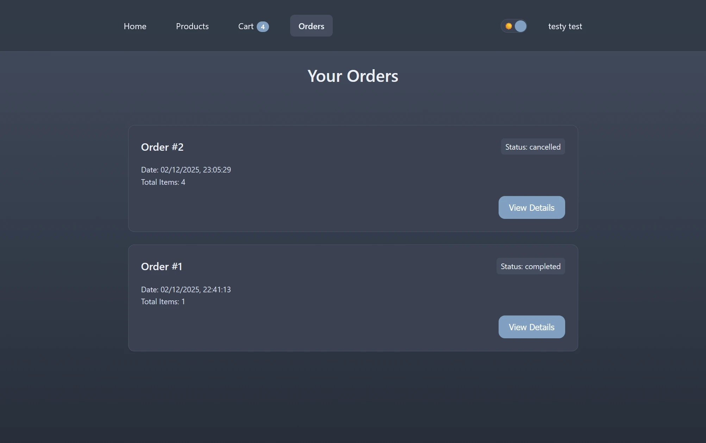
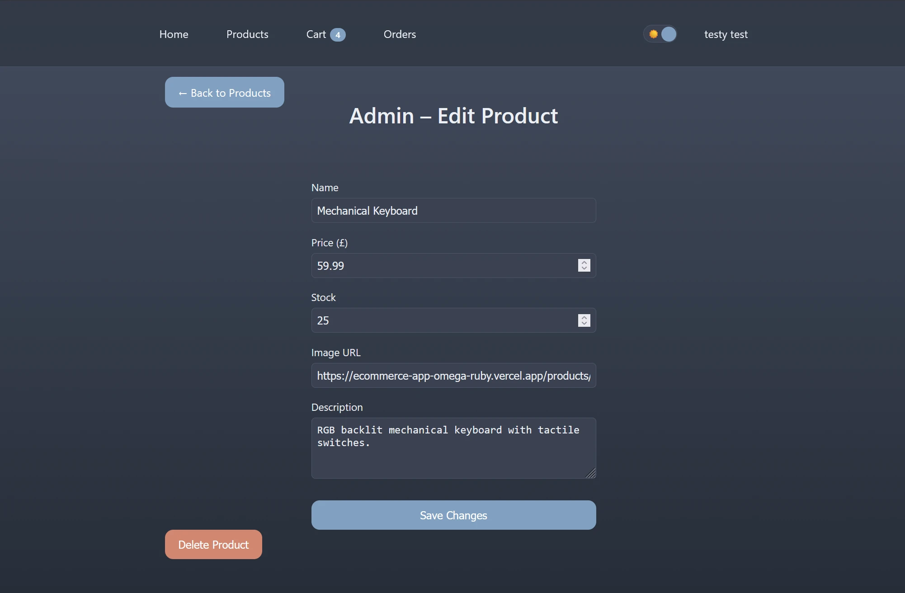
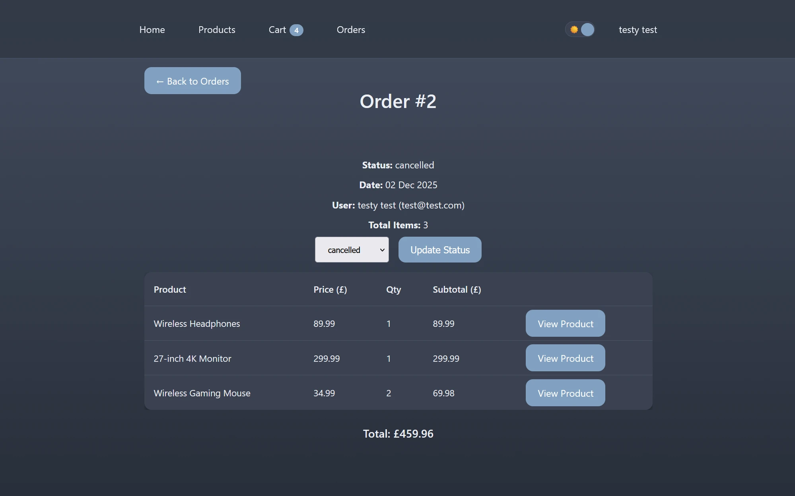

<h1>E-Commerce Web App (React + Flask)</h1>

A fully-featured full-stack e-commerce demo built for my software engineering portfolio.

<h2>❓ Why I built this project</h2>

I built this project to demonstrate my ability to design, implement, and deploy a complete full-stack application using modern tools.
During development I migrated the authentication system from session cookies to JWT-based auth in order to solve real-world cross-domain deployment issues and improve reliability across browsers.

My goals were to showcase:

-   Production-style authentication using JWT (access tokens)

-   A realistic e-commerce workflow (products → cart → checkout → orders)

-   Separation of user and admin features

-   Clean frontend architecture with reusable components

-   Working with cloud deployment platforms and debugging cross-domain issues

This project represents the level of structure, polish, and problem-solving I bring to engineering work.

<h2>🌍 Live Demo</h2>

Note: The deployed app may take a few seconds to load on first visit due to cold starts on the hosting platform.

Frontend (Vercel):
https://ecommerce-app-omega-ruby.vercel.app

Backend (Railway):
https://ecommerce-app-production-323f.up.railway.app

<h2>✨ Features</h2>

👤 Authentication & Accounts

    Register / Log in / Log out

    Secure JWT-based authentication (Flask-JWT-Extended)

    Token persisted in localStorage for session continuity across refresh

    Protected routes using backend token verification

    User profile page

    Automatic redirect back to previous page after login (?next=/original-page)

🛒 Shopping Experience

    Browse all products

    Product detail pages

    Add to cart (unauthenticated users redirected to login → returned afterward)

    Update or remove cart items

    Cart item count shown in navbar

📦 Orders System

    Checkout creates an order

    View full order history

    Detailed per-order view

🔐 Admin Panel

    Admin-only access

    Create, edit, delete products

    Manage all orders & update status

    Separate from user-facing routes

🎨 UX / UI

    Custom reusable component system (Cards, Grids, Buttons, Forms, Messages)

    Styled Components for consistent theme + design tokens

    Light/Dark mode with persistent preference

    Mobile-responsive layout

    Clean typography + spacing scale

<h2>🧱 Tech Stack</h2>

Frontend

    Framework & Routing

        React (Vite)

        React Router v6

    Styling & UI

        Styled Components (custom theme system)

        Reusable component library built from scratch

    Architecture

        API helper wrapper for consistent fetch logic

        LocalStorage sync for user + theme state

    Deployment & Tooling

        Hosted on Vercel

        Vitest + React Testing Library

Backend

    Framework & Auth

        Flask

        Flask-JWT-Extended for token-based authentication (JWT)

    Database & Models

        SQLAlchemy ORM

        Flask-Migrate (Alembic) for migrations

        PostgreSQL (Railway)

    Server & API Structure

        Gunicorn for production

        Organized via Blueprints

        CORS configured specifically for Vercel frontend

DevOps

    GitHub → automatic deploy to Vercel + Railway

    SQLite for local dev, PostgreSQL for production

    Product seeding via Railway shell

<h2>🧪 Testing</h2>

Backend (pytest)

    Authentication logic
        Auth tests cover JWT-protected routes and permission boundaries (user vs admin)

    Cart behaviour

    Order creation

    Product endpoints

    Database models

Frontend (Vitest + React Testing Library)

    Navbar behaviour

    Protected Routes

    Login/Register form logic

<h2>📁 Project Structure</h2>

<pre>
ecommerce-app/
├── backend/
│   ├── app/
│   │   ├── __init__.py
│   │   ├── config.py
│   │   ├── models.py
│   │   ├── routes/
│   │   ├── utils/
│   ├── migrations/
│   ├── tests/
│   ├── requirements.txt
│   ├── Procfile
│
└── frontend/
    ├── src/
    │   ├── App.jsx
    │   ├── pages/
    │   ├── components/
    │   ├── theme/
    │   ├── hook/
    │   │   └── useIsMobile.js
    │   ├── lib/
    │   │   └── api.js
    ├── public/products/
    ├── tests/
    ├── vite.config.js
    ├── vercel.json
</pre>

<h2>🖼 Screenshots</h2>

<i>Homepage</i>

 

<i>Product Detail</i>

 

<i>Cart</i>

 

<i>Orders</i>

 

<i>Admin Product Edit</i>

 

<i>Admin Order Status</i>

<h2>🚀 Deployment Setup</h2>

🔧 Backend (Railway)

    Gunicorn entrypoint:
        gunicorn "app:create_app()"

    Railway PostgreSQL database

    JWT authentication configured using environment-based secret key
        Tokens passed via Authorization header (Bearer scheme)

    CORS restricted to known frontend domains

    Alembic migrations

    Product seed script run via Railway shell

🎨 Frontend (Vercel)

    VITE_API_URL points to Railway backend URL

    vercel.json ensures SPA routing (“refresh-safe pages”)

    All fetches routed through a custom api() helper

    Credentials included for protected routes only

🔁 Protected Route Redirects

    Unauthenticated users are redirected to:

    /login?next=/previous-page

    After logging in, they return to where they started
    (e.g., Add-to-Cart → Login → Cart).

<h2>🗼 Lighthouse Scores</h2>

| Category       | Score Range |
| -------------- | ----------- |
| Performance    | 75–90       |
| Accessibility  | 85–100      |
| Best Practices | 95–100      |
| SEO            | 85–95       |

Scores vary slightly due to:

    Free hosting cold starts

    Railway → Vercel cross-domain latency

<h2>🧰 Local Development</h2>

Backend:

    cd backend pip install -r requirements.txt flask run

Frontend:

    cd frontend npm install npm run dev

Environment variables:

    frontend/.env:
        VITE_API_URL=http://localhost:5000

    backend/.env (local development only):
        SECRET_KEY=dev-secret-key
        SQLALCHEMY_DATABASE_URI=sqlite:///ecommerce.db

    Production environment variables are configured via the hosting platform (Railway).

⚠️ Previous Deployment Issue (Now Resolved)

    Earlier versions of this project used session cookies for authentication. When deployed across two domains (Vercel frontend and Railway backend), modern browser third-party cookie restrictions — especially in Chrome — caused inconsistent session persistence.

    To solve this properly, the authentication system was refactored to use JWT-based auth with Authorization headers instead of cookies. This:

    • Removes cross-site cookie issues
    • Works consistently across all browsers
    • More closely reflects real-world production APIs
    • Simplifies frontend/backend separation

    This change is reflected in the current implementation.

<h2>🔮 Future Improvements</h2>

    Standardise frontend component usage

    Update navbar with dynamic routes between standard and admin users

    Fix edgecase issues

    Product search, filtering & pagination

    Dedicated image hosting

    Additional mobile UI refinements

    Expanded frontend & backend test coverage (unit + integration tests)

    CI/CD pipeline with GitHub Actions (tests, linting, auto-deploy, staging)

    Payment provider integration

    Stock management (low-stock warnings, out-of-stock UI)

    Admin analytics dashboard

    Bundle optimisation + Lighthouse score improvements

<h2>✔ Final Notes</h2>

This project demonstrates:

    Full-stack architecture (frontend, backend, DB)

    Secure JWT-based authentication (stateless auth with protected routes)

    Database modelling, migrations, and seeding

    Realistic user & admin workflows

    Production deployments on two platforms

    Clean UI engineering

    Problem-solving around CORS, cookies & hosting constraints

    Modern frontend patterns (reusable components, theming, routing)

    Refactoring a live project to resolve real deployment issues (migrating auth architecture)
